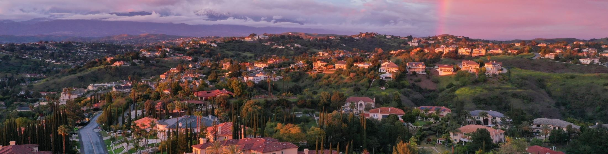
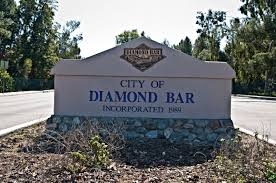

# Diamond Bar, California

**Diamond Bar** is a city in eastern Los Angeles County. It is also my hometown. The population is estimated to be just above 55,000. [Here](https://www.diamondbarca.gov) is the city's official website. The main high school serving the city is Diamond Bar High School. 

## The Vibe
Diamond Bar is a relatively quiet town. A mostly residential city, there are not many places of entertainment, mostly houses, grocery stores, restaurants, and tutoring centers. The residents would not describe it as a great town to visit, but a great town to live in. But one fun fact about this place is that it hosts the first hydrogen fueling station in Southern California, for whatever that counts.
Because the town is safe and slow, it is a great place for a family to move to. No worries about your kid being kidnapped at the park. Something great about Diamond Bar that I experienced growing up is how racially diverse it is. 

If this town sounds enticing to you, I invite you to explore the city further below and to one day move to **Diamond Bar**.

### See also
1. [Diamond Bar High School](https://dbhs.wvusd.org/)
2.  [Diamond Bar Wikipedia](https://en.wikipedia.org/wiki/Diamond_Bar,_California)